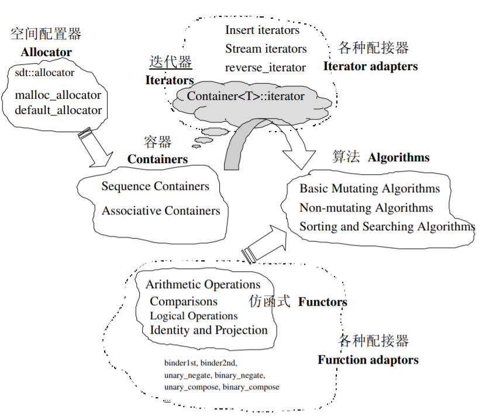

# STL简介

## STL六大组件

1. 容器: 各种数据结构，用于存放数据
   1. 序列式容器：vector,list,deque,stack,queue,forward-list
   2. 关联式容器: set,map,unordered_set,unordered_map
2. 分配器：负责空间的配置和管理
3. 算法：各种常用算法实现
4. 迭代器：可视为泛化指针，容器和算法之间的粘合剂
5. 适配器：修饰容器/算法/迭代器接口
6. 仿函数：类似函数，可视为算法的某种策略

Container通过Allocator取得数据储存空间，Algorithm通过Iterator存取Container内容，Functor可以协助 Algorithm完成不同的策略变化，Adapter可以修饰或套接 Functor。

