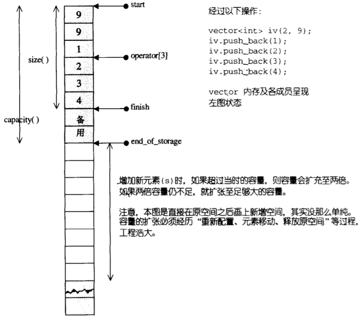
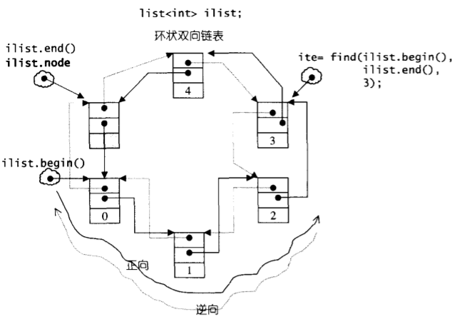
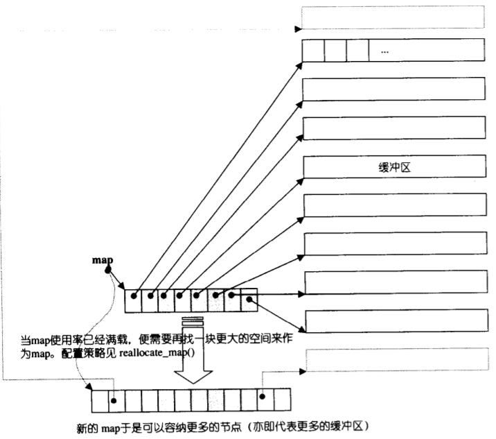
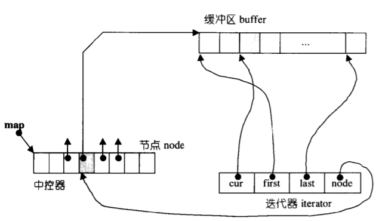

# 序列式容器

>序列容器中的元素是**可序**的，但未必是**有序**。

stl中的序列容器包含vector,list,deque,stack,queue,priority-queue队列。

## vector
- vector是一块连续的线性空间，随着元素的添加，能够动态的扩充空间。
- 由于是线性空间，vector的迭代器是随机访问迭代器。
- vector的数据结构是一块连续的线性空间，用2个迭代器start,finish指向空间中当前被使用的范围，迭代器end_of_storage指向连续空间的尾端。
- 当空间不够，vector需要动态增加大小：以原大小的**两倍**申请一块新的内存，然后将原内容拷贝到新的内存中，最后释放掉原内容。
 

## list
- list是双向链表，不是连续空间存储，每次插入/删除一个元素，就得配置或释放以元素空间，因此list对空间的运用是精准的。
- listNode的数据结构如下，可以看到有prev指针，next指针，和数据data组成。
- ```c++
  struct _List_node_base {
    _List_node_base* _M_next;
    _List_node_base* _M_prev;
  };
  template <class _Tp>
  struct _List_node : public _List_node_base {
    _Tp _M_data;
  };
  ```
- SGI-list是一个环状链表，只需要一个list_node指针就可以表示整个list.其中头节点和尾节点之间用一个空节点来区分。

- list的迭代器是双向迭代器，具备前移和后移的能力。这是因为list的存储不是连续空间，无法做到随机存取。
- list的插入/结合操作不会造成原有的list迭代器失效，而删除操作也只有“被铲除的元素”的迭代器会失效。
## deque
- deque是双向开口的连续线性空间，也就是可以在头尾两端插入/删除
- deque允许常数时间对头端进行元素的插入或移除。
- deque没有容量的概念，deque是动态的分段连续空间组合而成的，随时可以增加一段新的空间并链接。
- deque维护了map的信息（指针，大小），还维护了start、finish两个迭代器，分别指向第一个缓冲区的第一个元素和最后一个缓冲区的最后一个元素。
  ```c++
  class _Deque_base {
  ...
  protected:
    _Tp** _M_map; //map中控
    size_t _M_map_size;  //map大小
    iterator _M_start; //头迭代器
    iterator _M_finish; //尾迭代器
  ...
  }
  ```
- deque采用一块空间(map)来作为主控，map中每个元素都是指针，指向一段连续线性空间(缓冲区)，缓冲区是deque的存储主体。如果当前的map提供的节点不足，那么需要重新配置一块更大的map。申请新的2倍的map空间，并将旧的map拷贝到新的map的中间。

- deque的迭代器是随机访问迭代器，但是其实现是非常复杂的。迭代器需要维护四个指针，分别指向当前元素的位置(cur),所在缓冲区的起始边界(first), 所在缓冲区的末尾边界(last), 以及当前缓冲区的map节点。
  ```c++
  struct _Deque_iterator {
    ...
    _Tp* _M_cur;
    _Tp* _M_first;
    _Tp* _M_last;
    _Map_pointer _M_node;
    ...
  }
  ```
- 除此之外，为了能够模拟连续空间，deque迭代器还需重载operator++(),operator++(int),operator--(),operator--(int),operator+=(difference_type __n),operator+(difference_type __n),operator+(difference_type __n),operator-=(difference_type __n),operator-(difference_type __n),operator[](difference_type __n).
  ```c++
    _Self& operator++() {
    ++_M_cur;
    if (_M_cur == _M_last) {
      _M_set_node(_M_node + 1);
      _M_cur = _M_first;
    }
    return *this; 
  }
  _Self operator++(int)  {
    _Self __tmp = *this;
    ++*this;
    return __tmp;
  }

  _Self& operator--() {
    if (_M_cur == _M_first) {
      _M_set_node(_M_node - 1);
      _M_cur = _M_last;
    }
    --_M_cur;
    return *this;
  }
  _Self operator--(int) {
    _Self __tmp = *this;
    --*this;
    return __tmp;
  }

  _Self& operator+=(difference_type __n)
  {
    difference_type __offset = __n + (_M_cur - _M_first);
    if (__offset >= 0 && __offset < difference_type(_S_buffer_size()))
      _M_cur += __n;
    else {
      difference_type __node_offset =
        __offset > 0 ? __offset / difference_type(_S_buffer_size())
                   : -difference_type((-__offset - 1) / _S_buffer_size()) - 1;
      _M_set_node(_M_node + __node_offset);
      _M_cur = _M_first + 
        (__offset - __node_offset * difference_type(_S_buffer_size()));
    }
    return *this;
  }

  _Self operator+(difference_type __n) const
  {
    _Self __tmp = *this;
    return __tmp += __n;
  }

  _Self& operator-=(difference_type __n) { return *this += -__n; }
 
  _Self operator-(difference_type __n) const {
    _Self __tmp = *this;
    return __tmp -= __n;
  }

  reference operator[](difference_type __n) const { return *(*this + __n); }
  ```
- 迭代器和缓冲区、中控器的关系如下：



## stack
底层结构是deque,也可选择是vector

## queue
底层结构式deque,不能是vector


